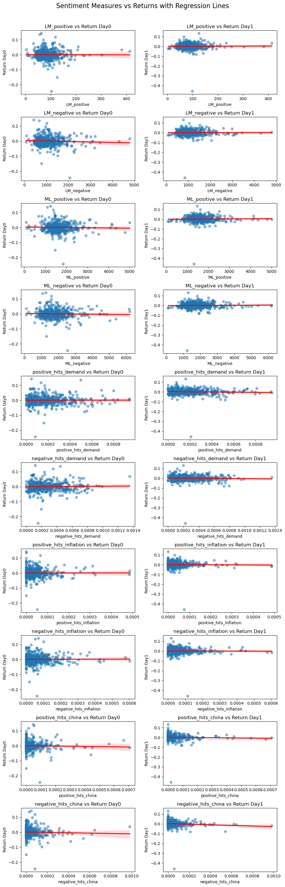

# 1. Abstract

The purpose of this analysis is to assess whether there is a correlation between the sentiment of specific topics discussed in a company's 10-K filing and its stock performance in the days following the release. Focusing on S&P 500 companies, the analysis evaluated how positively or negatively each 10-K addressed the topics of demand, inflation, and China, using a predefined sentiment dictionary. These sentiment scores were then compared to the company’s stock returns on the day of and the day after the 10-K release. The analysis ultimately found no significant correlation between the sentiment expressed in the filings on these topics and the subsequent stock performance.

# 2. Data

### Sample


The sample used in this analysis is based on the list of S&P 500 companies obtained from Wikipedia, consisting of 503 rows and 8 columns, including key information such as ticker symbols and CIK identifiers. An additional dataset, crsp_2022_only.zip, was also used. This file contains daily stock return data for S&P 500 firms throughout the year 2022, providing the basis for analyzing market reactions to 10-K filings.

### Return Variables

To construct the return variables, the first step was to determine the 10K filing date for each company. The 10K documents were organized in a nested folder structure, with the CIK as the folder name and the accession number stored within subfolders. Python was used to navigate through three levels of directories: CIK, submission type, and accession number. From each path, the CIK and accession number were extracted and stored them in a DataFrame.

Next the requests_html library was used to retrieve the filing date for each 10K. This was done by combining each company's CIK and accession number to construct the document URL and then extracting the filing date from the HTML using a CSS selector and saveing the results in a new DataFrame.

After, the following business day for each filing date, accounting for weekends and U.S. federal holidays needed to be computed. Using pandas the filing dates were converted to datetime format and applied a custom business day calendar based on the U.S. Federal Holiday calendar. This provided two dates for each filing: the filing date itself and the next business day.

To incorporate return data, daily stock returns for 2022 were sourced from GitHub. This dataset was merged with the updated S&P 500 table by matching on ticker symbol and date. The first merge aligned returns with the filing date, while the second merge added returns for the next business day using the pre-calculated next-day column. The final table contained each company’s ticker symbol, filing date, next business day, and the corresponding stock returns for both dates.

### Sentiment Variables

To build the sentiment variables, three topic categories were selected: demand, inflation, and China. These topics were chosen to reflect a broad range of factors, including market sentiment and geopolitical influences. Each category was associated with a set of relevant keywords.

A loop was used to analyze cleaned 10K text files stored in a specified directory. For each file, the text was read, converted to lowercase, and split into individual words.

Two sentiment dictionaries were applied: the Loughran-McDonald (LM) dictionary and a machine learning-based (ML) dictionary. The LM dictionary contained 347 positive words and 2345 negative words, while the ML dictionary included 75 positive words and 94 negative words.

For each 10k, the number of positive and negative word occurrences from both dictionaries was recorded as LM_positive, LM_negative, ML_positive, and ML_negative.

To capture topic-specific sentiment, the NEAR_finder function was applied to identify instances where sentiment words appeared within 10 words of a topic term. A window of 10 words was selected to balance the need for contextual relevance with the risk of including unrelated terms. A smaller window may miss important relationships, while a larger one could introduce noise.

These counts were normalized by dividing by the total number of words in each document to account for varying file lengths. This produced six topic-specific sentiment variables: positive_hits_demand, negative_hits_demand, positive_hits_inflation, negative_hits_inflation, positive_hits_china, and negative_hits_china.

Firm identifiers were extracted from each filename, and the resulting 10 sentiment variables were compiled into a DataFrame.

### Figure 1: Summary Statistics of Sentiment Variables


```python
import pandas as pd

# Load the CSV file
sample = pd.read_csv("output/analysis_sample.csv")

sample.describe()
```


<div>
<style scoped>
    .dataframe tbody tr th:only-of-type {
        vertical-align: middle;
    }

    .dataframe tbody tr th {
        vertical-align: top;
    }

    .dataframe thead th {
        text-align: right;
    }
</style>
<table border="1" class="dataframe">
  <thead>
    <tr style="text-align: right;">
      <th></th>
      <th>firm_id</th>
      <th>LM_positive</th>
      <th>LM_negative</th>
      <th>ML_positive</th>
      <th>ML_negative</th>
      <th>positive_hits_demand</th>
      <th>negative_hits_demand</th>
      <th>positive_hits_inflation</th>
      <th>negative_hits_inflation</th>
      <th>positive_hits_china</th>
      <th>negative_hits_china</th>
      <th>doc_length</th>
    </tr>
  </thead>
  <tbody>
    <tr>
      <th>count</th>
      <td>4.980000e+02</td>
      <td>498.000000</td>
      <td>498.000000</td>
      <td>498.000000</td>
      <td>498.000000</td>
      <td>498.000000</td>
      <td>498.000000</td>
      <td>498.000000</td>
      <td>498.000000</td>
      <td>498.000000</td>
      <td>498.000000</td>
      <td>498.000000</td>
    </tr>
    <tr>
      <th>mean</th>
      <td>7.851046e+05</td>
      <td>90.128514</td>
      <td>1129.899598</td>
      <td>1655.064257</td>
      <td>1834.421687</td>
      <td>0.000205</td>
      <td>0.000279</td>
      <td>0.000046</td>
      <td>0.000072</td>
      <td>0.000039</td>
      <td>0.000048</td>
      <td>70730.618474</td>
    </tr>
    <tr>
      <th>std</th>
      <td>5.501943e+05</td>
      <td>41.621021</td>
      <td>556.411040</td>
      <td>576.361811</td>
      <td>782.710121</td>
      <td>0.000173</td>
      <td>0.000207</td>
      <td>0.000060</td>
      <td>0.000080</td>
      <td>0.000082</td>
      <td>0.000097</td>
      <td>29366.752675</td>
    </tr>
    <tr>
      <th>min</th>
      <td>1.800000e+03</td>
      <td>3.000000</td>
      <td>86.000000</td>
      <td>94.000000</td>
      <td>112.000000</td>
      <td>0.000000</td>
      <td>0.000000</td>
      <td>0.000000</td>
      <td>0.000000</td>
      <td>0.000000</td>
      <td>0.000000</td>
      <td>9785.000000</td>
    </tr>
    <tr>
      <th>25%</th>
      <td>9.727650e+04</td>
      <td>66.000000</td>
      <td>757.250000</td>
      <td>1321.000000</td>
      <td>1331.250000</td>
      <td>0.000068</td>
      <td>0.000118</td>
      <td>0.000012</td>
      <td>0.000021</td>
      <td>0.000000</td>
      <td>0.000000</td>
      <td>52073.500000</td>
    </tr>
    <tr>
      <th>50%</th>
      <td>8.825095e+05</td>
      <td>83.000000</td>
      <td>1025.000000</td>
      <td>1588.500000</td>
      <td>1686.500000</td>
      <td>0.000169</td>
      <td>0.000228</td>
      <td>0.000030</td>
      <td>0.000052</td>
      <td>0.000000</td>
      <td>0.000007</td>
      <td>65952.000000</td>
    </tr>
    <tr>
      <th>75%</th>
      <td>1.136007e+06</td>
      <td>105.000000</td>
      <td>1334.500000</td>
      <td>1897.000000</td>
      <td>2113.750000</td>
      <td>0.000281</td>
      <td>0.000400</td>
      <td>0.000059</td>
      <td>0.000094</td>
      <td>0.000044</td>
      <td>0.000055</td>
      <td>80897.250000</td>
    </tr>
    <tr>
      <th>max</th>
      <td>1.868275e+06</td>
      <td>414.000000</td>
      <td>4797.000000</td>
      <td>5009.000000</td>
      <td>6210.000000</td>
      <td>0.000949</td>
      <td>0.001355</td>
      <td>0.000488</td>
      <td>0.000604</td>
      <td>0.000710</td>
      <td>0.000983</td>
      <td>271718.000000</td>
    </tr>
  </tbody>
</table>
</div>


Figure 1 shows the summary statistics of the 10 sentiment variable. The summary statistics provide key insights into the sentiment variables in the dataset. With 498 observations for each variable, there are no missing values, ensuring a complete dataset for analysis. The high standard deviations for LM_negative (556.41) and ML_negative (782.71) indicate significant variation across firms, suggesting that some companies use far more negative language than others.

# 3. Results

### Figure 2: Correlation Table


```python
clean_data = pd.read_csv("clean_data.csv")

sentiment_measures = [
    'LM_positive', 'LM_negative', 'ML_positive', 'ML_negative',
    'positive_hits_demand', 'negative_hits_demand', 'positive_hits_inflation',
    'negative_hits_inflation', 'positive_hits_china', 'negative_hits_china'
]

return_measures = ["Return Day0", "Return Day1"]

# Compute correlation
correlation_table = clean_data[sentiment_measures + return_measures].corr().loc[sentiment_measures, return_measures]

# Display the result
print(correlation_table)
```

                             Return Day0  Return Day1
    LM_positive                -0.005780     0.011752
    LM_negative                -0.056000     0.005835
    ML_positive                -0.027934     0.017887
    ML_negative                -0.031210     0.018653
    positive_hits_demand        0.002311    -0.046195
    negative_hits_demand        0.020355    -0.039556
    positive_hits_inflation     0.000408    -0.019094
    negative_hits_inflation     0.007351    -0.011974
    positive_hits_china        -0.031896    -0.036592
    negative_hits_china        -0.036237    -0.089207


### Figure 3: Scatterplots of Each Sentiment Measure Against Return Measures


```python
import pandas as pd
import matplotlib.pyplot as plt
import seaborn as sns

df = pd.read_csv("clean_data.csv")

sentiment_vars = [
    'LM_positive', 'LM_negative', 'ML_positive', 'ML_negative',
    'positive_hits_demand', 'negative_hits_demand', 'positive_hits_inflation',
    'negative_hits_inflation', 'positive_hits_china', 'negative_hits_china'
]

return_vars = ['Return Day0', 'Return Day1']


n_rows = len(sentiment_vars)
n_cols = len(return_vars)

fig, axes = plt.subplots(n_rows, n_cols, figsize=(10, n_rows * 3), sharex=False, sharey=False)

for i, sentiment in enumerate(sentiment_vars):
    for j, ret in enumerate(return_vars):
        ax = axes[i, j]
        sns.regplot(
            data=df,
            x=sentiment,
            y=ret,
            ax=ax,
            scatter_kws={'alpha': 0.5},
            line_kws={'color': 'red'}
        )
        ax.set_title(f"{sentiment} vs {ret}")
        ax.set_xlabel(sentiment)
        ax.set_ylabel(ret)

plt.tight_layout()
plt.suptitle("Sentiment Measures vs Returns with Regression Lines", fontsize=16, y=1.02)
plt.show()
```


    

    


**Q1. Compare / contrast the relationship between the returns variable and the two “LM Sentiment” variables (positive and negative) with the relationship between the returns variable and the two “ML Sentiment” variables (positive and negative).**

### Figure 4: Correlation Between Dictionaries and Return


```python
import pandas as pd

# Load data
clean_data = pd.read_csv("clean_data.csv")

# Define variable lists
sentiment_vars = ['LM_positive', 'LM_negative', 'ML_positive', 'ML_negative']
return_vars = ['Return Day0']  # Add 'Return Day1' if needed

# Compute correlation between sentiment variables and return(s)
correlation = clean_data[sentiment_vars + return_vars].corr()

# Display only sentiment vs returns
result = correlation.loc[sentiment_vars, return_vars]

print(result)
```

                 Return Day0
    LM_positive    -0.005780
    LM_negative    -0.056000
    ML_positive    -0.027934
    ML_negative    -0.031210


LM Sentiment vs Day 0 Returns

LM_positive = -0.0057: This demonstrates basically no correlation between the count of LM_positive words and same day stock returns.

LM_negative = -0.056: This shows a weak negative correlation. There may be a small relationship between the number of LM_negative words used in the 10-K and worse stock returns.

ML Sentiment vs Day 0 Returns

ML_positive = -0.027934: shows a slight negative correlation. This suggests that even machine learning identified positive sentiment does not necessarily drive better short term stock performance.

ML_negative = -0.031210: This implies that machine learning based negative sentiment captures some downside risk, but not as strongly as the LM dictionary.

Takeaways

Negative sentiment appears slightly more useful than positive sentiment in explaining stock returns. ML sentiment shows weaker correlations compared to the LM dictionary, which may indicate that the ML based approach captures a different aspect of sentiment that does not directly influence immediate returns.

Overall, the correlations suggest no strong sentiment return relationship in the immediate short-term, meaning factors beyond textual sentiment likely drive market movements

**Q2. If your comparison/contrast conflicts with Table 3 of the Garcia, Hu, and Rohrer paper (ML_JFE.pdf, in the repo), discuss and brainstorm possible reasons why you think the results may differ.**

The results found in this study differ significantly from the findings of Garcia, Hu, and Rohrer. Mainly the correlations found in this analysis tend to be signifcantly smaller than the ones found in ML_JFE. A possible reason for this discrepancy is due to the sample size of the study. the ML study includes 76,922 firm-year observations over decades (1995–2018), while this analysis focuses on S&P 500 firms in a single year (2022). The larger dataset allows their study to pick up long-term patterns, while this one may be more affected by short-term market noise or specific conditions in 2022. a Larger sample size ensures that the results are not just an anomaly and the inclusion of more firms across time reduces the risk of results being biased by a specific period or market condition.

**Q3. Discuss your 3 “contextual” sentiment measures. Do they have a relationship with returns that looks “different enough” from zero to investigate further? If so, make an economic argument for why sentiment in that context can be value relevant.**

### Figure 5: Correlation Between Contextual Sentiment Measures and Return


```python
import pandas as pd

# Load data
clean_data = pd.read_csv("clean_data.csv")

# Define variable lists
sentiment_var = [
    'positive_hits_demand', 'negative_hits_demand', 'positive_hits_inflation',
    'negative_hits_inflation', 'positive_hits_china', 'negative_hits_china'
]

return_measure = ["Return Day0"]


# Compute correlation between sentiment variables and return(s)
correlation = clean_data[sentiment_var + return_measure].corr()

# Display only sentiment vs returns
result = correlation.loc[sentiment_var, return_measure]

print(result)
```

                             Return Day0
    positive_hits_demand        0.002311
    negative_hits_demand        0.020355
    positive_hits_inflation     0.000408
    negative_hits_inflation     0.007351
    positive_hits_china        -0.031896
    negative_hits_china        -0.036237


Demand Sentiment:
Positive sentiment has almost no correlation with returns (0.0023). Negative sentiment shows a weak positive correlation (0.0204), suggesting that firms discussing demand negatively may experience slightly better same day stock performance.

Inflation Sentiment:
Both positive (0.0004) and negative (0.0074) inflation sentiment have near-zero correlations, indicating that inflation discussions in 10-Ks do not significantly impact same-day returns. Investors may have already accounted for inflation risks before the filing release.

China Sentiment:
Negative China sentiment has the strongest negative correlation (-0.0362), while positive sentiment is also negative (-0.0319). Unlike demand and inflation, any mention of China—whether positive or negative—is associated with lower same-day stock returns. This suggests that firms referencing China face investor skepticism, possibly due to concerns over trade relations, regulatory risks, or supply chain issues.

China-related sentiment appears most relevant for same day stock movements, with both positive and negative mentions linked to lower returns. This trend could reflect market fears surrounding geopolitical instability. Demand and inflation sentiment, however, show little to no immediate impact, implying that these factors are most likely already priced in to the stock price.

**Q4. Is there a difference in the sign and magnitude? Speculate on why or why not.**

The ML sentiment variables, both positive and negative, show weak relationships with same day stock returns, but there are key differences in their sign and magnitude. ML positive sentiment has a slightly negative correlation (-0.0279) with Return Day0, indicating that a more optimistic tone in a firm’s 10-K filing does not necessarily lead to an increase in stock price. This could suggest that investors are skeptical of excessively positive language or that such sentiment is too generic to provide meaningful information for market reactions.

Similarly, ML negative sentiment is also negatively correlated (-0.0312) with Return Day0, though the effect is slightly stronger than for ML positive sentiment. This aligns with expectations that firms using more negative language in their filings may be signaling risk, uncertainty, or future challenges, leading to lower same day returns. The fact that negative sentiment has a slightly greater impact than positive sentiment supports the idea that markets react more strongly to bad news than to good news. Despite these patterns, both correlations remain weak, suggesting that ML sentiment alone is not a strong predictor of same day stock performance.
